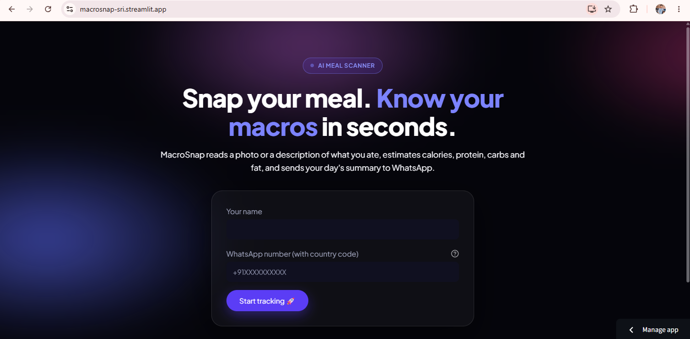
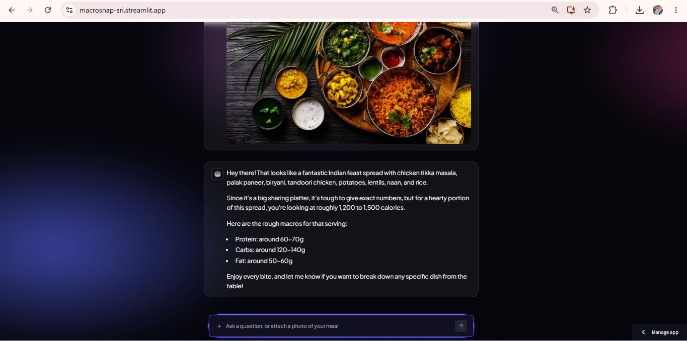
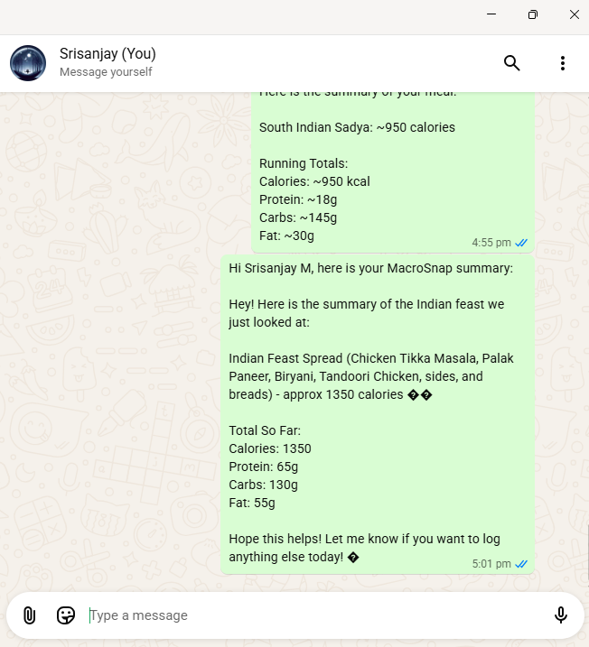

# 🥗 MacroSnap

**Snap your meal. Know your macros in seconds.**

An AI vision chatbot that estimates calories and macros from a photo or a text description of your meal, then turns your whole conversation into a WhatsApp-ready summary.

🔗 **Live app:** https://macrosnap-sri.streamlit.app

> The live demo runs on a free Gemini API quota. If it stops responding, the daily quota may be used up. Try again later.

## Screenshots

| Onboarding | Chat | WhatsApp summary |
|---|---|---|
|  |  |  |

## Features

- Send a meal photo or type what you ate, and get estimated calories, protein, carbs and fat
- Chat with memory, so follow-ups like "what if I add an egg?" work
- Stays on topic: food, nutrition and fitness only
- One click builds a summary of every meal in the conversation and opens it in WhatsApp
- Retries automatically when the Gemini API is busy or returns an empty reply
- Phone number validation on the onboarding form
- Custom dark UI with an animated background, built with CSS on top of Streamlit

## Tech stack

- **Python** and **Streamlit** for the app
- **Google Gemini** for image understanding and chat
- **WhatsApp click-to-chat (wa.me)** to deliver the summary
- **Streamlit Community Cloud** for deployment

## How it works

Photo or text → Streamlit → Gemini → summary → WhatsApp

## Run locally

```bash
git clone https://github.com/srisanjay-sj/macrosnap.git
cd macrosnap
python -m venv venv
venv\Scripts\activate
pip install -r requirements.txt
streamlit run app.py
```

Create `.streamlit/secrets.toml` with your key:

```toml
GEMINI_API_KEY = "your-key-here"
```

This file is git-ignored and never committed.

## Credits

Built by Srisanjay M, based on an NxtWave workshop project (Gemini + Streamlit + WhatsApp). My additions: error and empty-reply retry, phone validation, the wa.me delivery flow (the workshop used Twilio, which my trial account could not send from), and the redesigned UI.